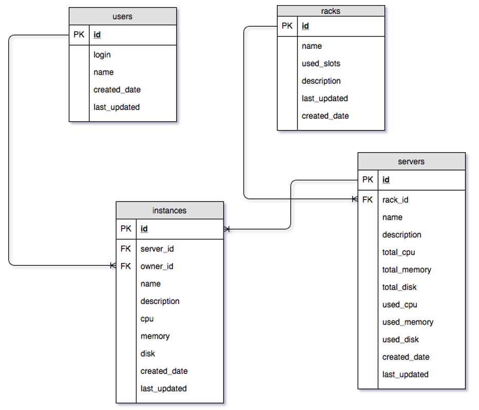

<p align="center">
  <a href="" rel="noopener">
 </a>
</p>

<h3 align="center">Datacenter Management Application</h3>

<div align="center">

[]()
[](https://github.com/rohitswarke/city-details/issues)
[](https://github.com/rohitswarke/city-details/pulls)
[](/LICENSE)
</div>

---

<p align="center"> This application demonstrates use of Web and CLI interfaces to manage inventory in a datacenter.
<br> 
</p>

## 📝 Table of Contents

- [About](#about)
- [Entity Relationship Diagram](#entity_relationship_diagram)
- [Query Operations](#query_operations)
- [Getting Started](#getting_started)
- [Usage](#usage)
- [Built Using](#built_using)
- [Authors](#authors)
- [Acknowledgments](#acknowledgement)

## 🧐 About <a name = "about"></a>

A typical datacenter contains a series of racks that hold a number of baremetal servers each. Users then proceed to create virtual instances on these servers. Periodically, when old server racks need to be decommissioned, the virtual instances are moved from one baremetal server to another. Before the decommissioning, we need to ensure that all instances running on the servers are moved to other servers. 

The application can be used to:

- Provision racks and servers
- Decommission racks and servers
- Retrieve existing rack, server, instances info
- Add/remove instances
- Manage ownership of instances
- Move instances between servers

There are four entities that the application manages, namely racks, users, servers and instances. Each of these entities are stored in separate tables that refer to each other. There are certain constraints that need to be met while adding/removing these entities.

- A Rack cannot be deleted when it has server(s) on it. A user would have to delete servers on a rack before deleting the rack itself.
- Similarly, servers that run instances cannot be deleted before those instances are either deleted or moved to different server.
- However, before adding or moving an instance, we should ensure that the target server has enough resources to hold the instance.
- Users who actively own instances cannot be removed either.

The application checks the above mentioned constraints before modifying the tables.

## Entity Relationship Diagram <a name = "entity_relationship_diagram"></a>

Below is ER diagram depicting the relationship between the above entities.



## Query Operations <a name = "query_operations"></a>

| Command | Query | Description |
| --- | --- | --- |
| Add user | insert into users(login,name,last_updated) values(?,?,?) | Add a new user |
| Retrieve users | select u.*,ifnull(i.num_instances,0) as num_instances from users u left join (select owner_id,count(*) as num_instances from instances group by owner_id) i on i.owner_id=u.id | Retrieve user info along with the count of instances owned by the user |
| Delete user | select count(*) as count from instances where owner_id=?;<br>  delete from users where id=?; | Delete user only if the user does not own any instances |
| Add rack | INSERT INTO racks(name,total_slots,description,last_updated) values(?,?,?,?) | Add a new rack |
| Delete rack | select count(*) as count from servers where rack_id=?;<br> delete from racks where id=?; | Delete the rack only if it is not running any instances |
| Add server | select count(*) as count from servers where rack_id=?; insert into servers(rack_id,name,description,total_cpu,total_memory, total_disk,last_updated) VALUES(?,?,?,?,?,?,?); | Add a server only if there is enough space left on the tack |
| List servers | select s.*,ifnull(i.num_instances,0) as num_instances from servers s left join (select server_id,count(*) as num_instances from instances group by server_id) i on s.id=i.server_id | List servers and the number of instances they hold |
| Delete servers | select count(*) as count from instances where server_id=?;<br>  delete from servers where id=? | Delete server if it does not have any instances |
| Add instance | insert into instances(server_id,name,description,cpu,memory,disk,owner_id,last_updated);<br> update servers set used_cpu=?,used_memory=?,used_disk=?,last_updated=? where id=? | Add a new instance if it has enough resources and update the server resources info |
| Delete instances | delete from instances where id=? ;<br> update servers set used_cpu=?,used_memory=?,used_disk=?,last_updated=? where id=? | Delete the instance and free up server resources |
| Move instances | update instances set server_id=?,last_updated=? where id=?;<br>  update servers set used_cpu=?,used_memory=?,used_disk=?,last_updated=? where id=? ;<br>  update servers set used_cpu=?,used_memory=?,used_disk=?,last_updated=? where id=? | Check for resources on the target server and move the instance. Update the resource usage on the source and target servers |

## 🏁 Getting Started <a name = "getting_started"></a>


These instructions will get you a copy of the project up and running on your local machine for development and testing purposes. See [deployment](#deployment) for notes on how to deploy the project on a live system.

SQLite Database:

The SQLite database can be created by running the script
```
python init_db.py
```

### Prerequisites

You need following things on your local system to get started with this project:

- VS Code
- Dev Containers extension
- Docker Desktop

The project contains .devcontainer which takes care of creating docker dev environment and it is using Dockerfile as input so you do not need to install any python package or its dependencies on your local system. This .devenvironment will take care of it automatically in your VS Code.

## 🎈 Usage <a name="usage"></a>

### To start UI


Manage Instances


### CLI Tool Usage

- The tool can be used to manipulate users, racks, servers and instances.
- General usage is 
```
./cli.py <command> <subcommand> <options>
```
Every command and sub-command has built in help info for users to understand its usage.


List Resources


Add Resources


Debug Mode

The CLI tool can be put in debug/logging modes by using the option "--debug" or "--logging". This can be used to get a detailed log of what the tool does.

Below example shows the logging mode output while adding a new instance:


## ⛏️ Built Using <a name = "built_using"></a>

- [Flask](https://flask.palletsprojects.com/en/2.3.x/) - Web Framework
- [SQLite3](https://docs.python.org/3/library/sqlite3.html) - Database

## ✍️ Authors <a name = "authors"></a>

- [@rohitswarke](https://github.com/rohitswarke) - Idea & Initial work
- [@navops29](https://github.com/navops29) - Idea & Initial work

See also the list of [contributors](https://github.com/rohitswarke/dcmgr/contributors) who participated in this project.

## 🎉 Acknowledgements <a name = "acknowledgement"></a>

- Hat tip to anyone whose code was used
- Inspiration
- References
